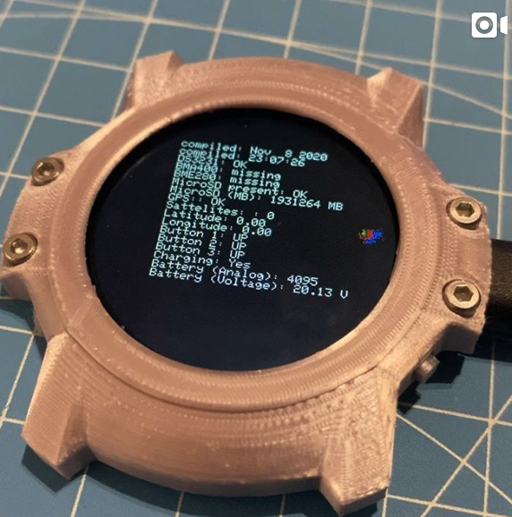

# Open Smartwatch

## Organization / Coordination

* [GitHub: Open Smartwatch](https://github.com/Open-Smartwatch)
* [Discord: Pauls 3D Things](https://discord.gg/9DK5JY6) 

## Current Status

The hardware and software are under development.
The v1.0 hardware has been assembled and reviewed. Many improvements need to be made.

Click on an image below to see some tech-demos:

## Goals

The goal is to build an open source smartwatch, with gps tracking and maps.

- GPS
- Time
- Sensors (Acceleromter, Barometer, Temperature, Humidity)
- Li-Ion Battery
- USB Serial
- uSD Card (to provide open streetmap tiles)

## Hardware

Repositoryies: 

### BOM

See: [https://htmlpreview.github.io/?https://github.com/Open-Smartwatch/kicad-project/blob/master/docs/bom/osw-ibom_v.html](https://htmlpreview.github.io/?https://github.com/Open-Smartwatch/kicad-project/blob/master/docs/bom/osw-ibom_v.html)

### Schematic

### Plots

## Software 

Repositories:

* Open-Smartwatch OS: [https://github.com/Open-Smartwatch/open-smartwatch-os](https://github.com/Open-Smartwatch/open-smartwatch-os)
* Open-Smartwatch Libraries: [https://github.com/Open-Smartwatch/lib-open-smartwatch](https://github.com/Open-Smartwatch/lib-open-smartwatch)

## 3D-Printable Case

Repository: [https://github.com/Open-Smartwatch/3d-files](https://github.com/Open-Smartwatch/3d-files)

### Case v1.0

