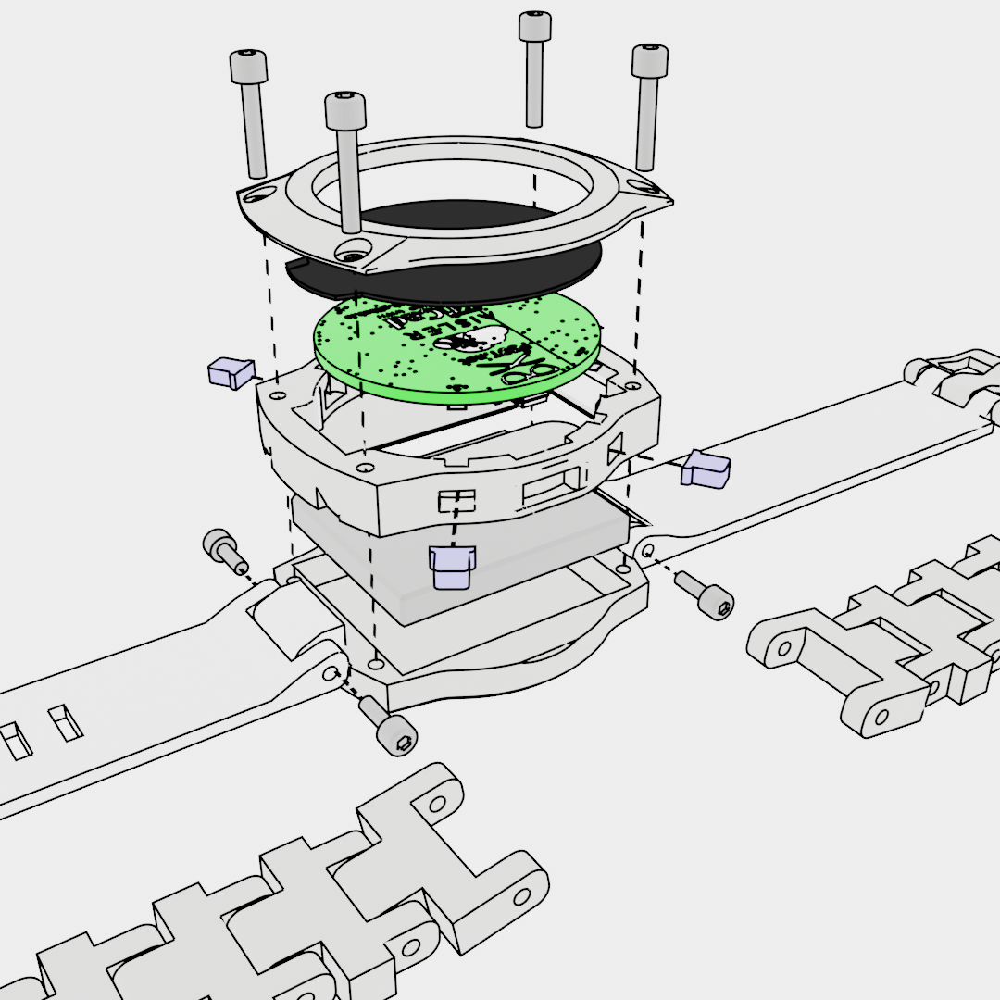
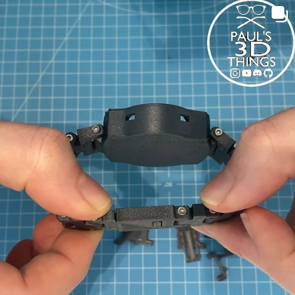
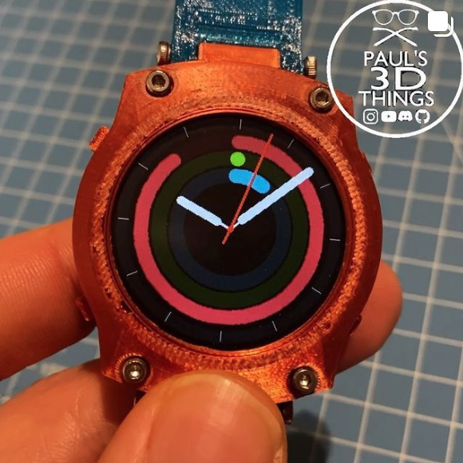
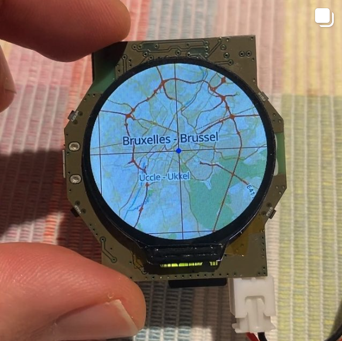

# Open Smartwatch

## Current Status

* GPS Edition
    - PCB: still under development
    - 3D printable case: TODO

* Light Edition
    - PCB: [Released v3.2](https://github.com/Open-Smartwatch/open-smartwatch-light/releases/tag/v3.2)
    - 3D printable case: ready

Click on an image below to see some demos:

## Goals

The goal is to build an open source smartwatch, with step counting, GPS tracking and maps.

- ESP32 (Arduino programmable)
- GPS
- Time
- Sensors (Acceleromter, Step Counting)
- Li-Ion Battery
- USB Serial
- uSD Card (to provide open streetmap tiles)

## Media Coverage

- hackster.io: [Something ESPecially Impressive about the Open-Smartwatch Project](https://www.hackster.io/news/there-s-something-especially-impressive-about-the-opensmartwatch-project-c2c878b983cf)

## Join the Discussion

* Discussions happen on Discord: [Pauls 3D Things](https://discord.gg/9DK5JY6) 
* Github organization: [https://github.com/Open-Smartwatch](https://github.com/Open-Smartwatch)

## Hardware

### GPS Edition

* PCB Source Files (KiCAD): [https://github.com/Open-Smartwatch/open-smartwatch-gps](https://github.com/Open-Smartwatch/open-smartwatch-gps)
* BOM: [https://htmlpreview.github.io/?https://github.com/Open-Smartwatch/open-smartwatch-gps/blob/master/docs/bom/osw-ibom_v.html](https://htmlpreview.github.io/?https://github.com/Open-Smartwatch/open-smartwatch-gps/blob/master/docs/bom/osw-ibom_v.html)
* 3D Files: [https://github.com/Open-Smartwatch/3d-files/tree/master/case-gps](https://github.com/Open-Smartwatch/3d-files/tree/master/case-gps)

### Light Edition

* PCB Source File (KiCAD): [https://github.com/Open-Smartwatch/open-smartwatch-light](https://github.com/Open-Smartwatch/open-smartwatch-light)
* Order PCB here: [https://aisler.net/p/EBEIQYQD](https://aisler.net/p/EBEIQYQD) (Hint: AISLER sponsored the PCBs for protoyping this project, hence the logo on the PCB ;) )
* BOM: [https://htmlpreview.github.io/?https://github.com/Open-Smartwatch/open-smartwatch-light/blob/master/docs/bom/osw-light-ibom.html](https://htmlpreview.github.io/?https://github.com/Open-Smartwatch/open-smartwatch-light/blob/master/docs/bom/osw-light-ibom.html)
* 3D Files: [https://github.com/Open-Smartwatch/3d-files/tree/master/case-light](https://github.com/Open-Smartwatch/3d-files/tree/master/case-light)

## The Big BOM

The parts for the GPS Edition are a super set of the Light Edition, so the following list covers the GPS Edition:

|Part|Description|Aliexpress Link |
|:--:|:--:|:---|
|U7 | TTGO T-MICRO32 | https://www.aliexpress.com/item/32869180373.html |
|U4 | GC9A01 | https://www.aliexpress.com/item/1005001382307998.html |
|U8 | Quectel L96-M33 | https://www.aliexpress.com/item/32920337260.html |
|D1 | LED 0805 | https://www.aliexpress.com/item/32947001269.html |
|U2 | BMA400 | https://www.aliexpress.com/item/4001043933700.html |
|U6 | CH340E | https://www.aliexpress.com/item/4000171821951.html |
|U1 | DS3231MZ | https://www.aliexpress.com/item/32962505279.html |
|U3 | PSRAM | https://www.aliexpress.com/item/4000242457828.html |
|U10,U13 | XC6209F332MR-G | https://www.aliexpress.com/item/4000687517883.html |
|U11 | MCP73831T-2ACI/OT SOT23-5 | https://www.aliexpress.com/item/32714249253.html |
|U9 | TPS2115APWR | https://www.aliexpress.com/item/32612393464.html |
|U5 | USB-Micro | https://www.aliexpress.com/item/32820570603.html |
|SW1, SW2, SW4, SW5 | Buttons | https://www.aliexpress.com/item/32870278366.html |
|XS1 | uSD Slot | https://www.aliexpress.com/item/1005001470093106.html |
|Q1 | 2N7002 | https://www.aliexpress.com/item/32912312094.html |
|R1-RN | 0603 SMD R | https://www.aliexpress.com/item/32298348854.html |
|C5,C6 | 1206 SMD C | https://www.aliexpress.com/item/32956133014.html |
|C1-CN | 0603 SMD C | https://www.aliexpress.com/item/32841971485.html |
|R5 | blob of solder | N/A|

### Further Material

This might be useful to give you an orientation of parts used to assemble this project:

|Material | Aliexpress Link |
|:--|:---|
|Solder Paste | https://www.aliexpress.com/item/33057598049.html |
|Desoldering Wire | https://www.aliexpress.com/item/32958719300.html |
|Flux | https://www.aliexpress.com/item/4000480154850.html |
|Soldering Iron | https://www.aliexpress.com/item/32860309312.html |
|Hot Plate | https://www.aliexpress.com/item/32974173898.html |

## Software 

Repositories:

* Open-Smartwatch OS: [https://github.com/Open-Smartwatch/open-smartwatch-os](https://github.com/Open-Smartwatch/open-smartwatch-os), see Readme.md
* Open-Smartwatch Libraries: [https://github.com/Open-Smartwatch/lib-open-smartwatch](https://github.com/Open-Smartwatch/lib-open-smartwatch), see Readme.md

## Super-Quick-Start Guide 

After adding the OS to VScode with PlatformIO (recommended tutorial: https://youtu.be/JmvMvIphMnY (external link to YouTube)) you can change the config.h.example file in ./include to suit your data, and change it to a header file (remove .example). 
For uploading, you need to hold the lower left button and then click the reset button (top left). It enables flash mode, the display should get dark. Orientation for the display: USB insert at the left side. 
App changer works by holding the lower left button to switch to your desired app. 
