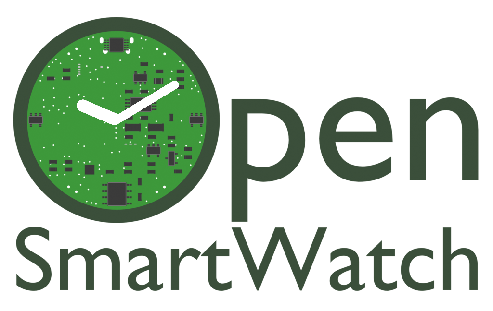
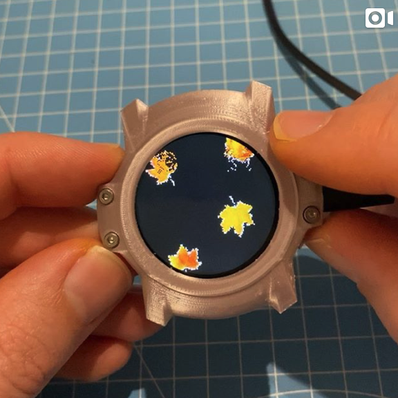
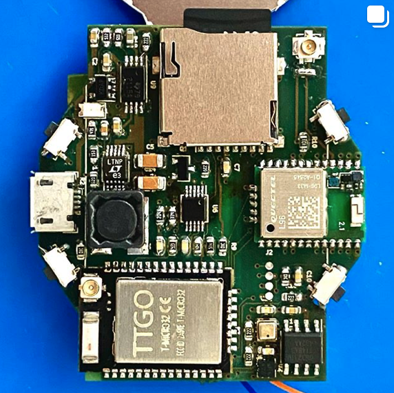
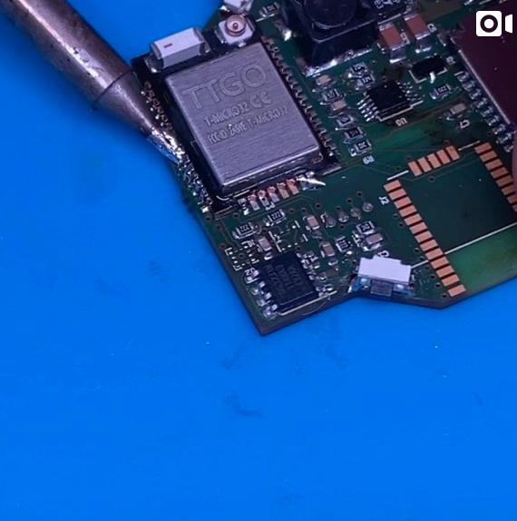
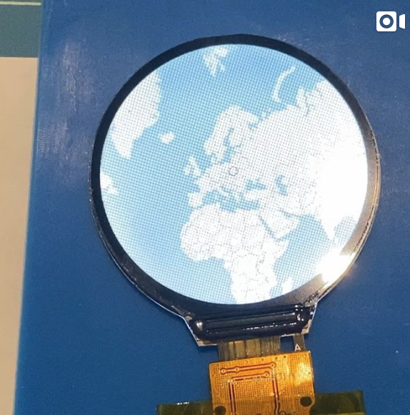
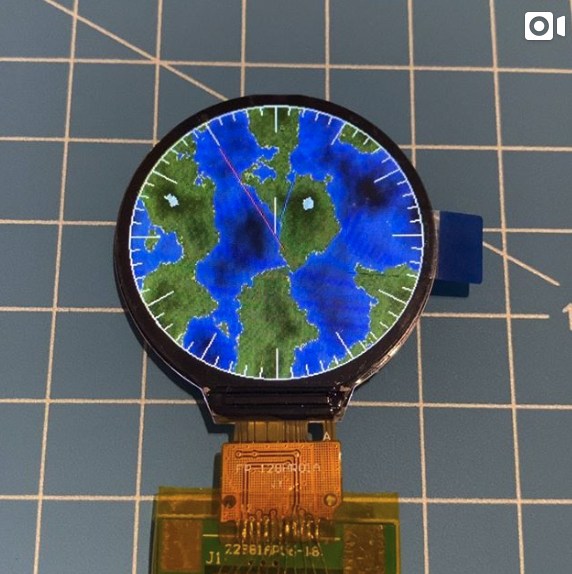
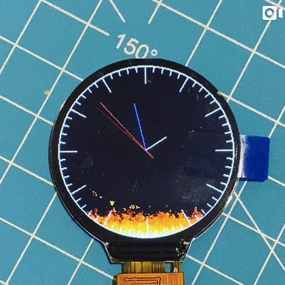

# Overview

The Open-SmartWatch is an open source project created by [@pauls_3d_things](https://www.instagram.com/pauls_3d_things/)/[p3dt.net](https://p3dt.net).
It consists of hardware modules, 3D printable cases and a custom operating system to build smartwatches with the goal that they can be assembled, repaired, and modified by everyone.

There are currently two versions, a [GPS edition](/2_gps-edition/) (pre-released, work in progress) and a [Light edition](/1_light-edition/) (released), which share the following hardware:

* EPS32-micro-D4: 2x240MHz, 320KB RAM
* Bluetooth 4.2 BR/EDR BLE
* WiFi 2.4GHz 802.11 b/g/n
* GC9A01 240x240 16bit TFT display (round)
* BMA400 Accelerometer + Pedometer
* MCP73831 LiPo Charger
* CH340E USB Serial

The GPS edition has additionally:

* Quectel L96 GPS module
* 4MB RAM
* microSD

The PCB (KiCAD), Case design files (Blender), and Operating System (C++/Arduino/PlatformIO) are all created with open source software, and are hosted on GitHub (see links below).

## Media Coverage

* `@pauls_3d_things` on [Instagram](https://www.instagram.com/pauls_3d_things/) (Latest Updates!)
* `#opensmartwatch` on [Instagram](https://www.instagram.com/explore/tags/opensmartwatch/) (See what the community creates!)
* `pauls_3d_things` on [Youtube](https://www.youtube.com/playlist?list=PL7YtNcHw1zWL9PEBSJg6sBpESSBoHjDY6) (Tutorials + Instructions!)
* hackster.io: [Something ESPecially Impressive about the Open-Smartwatch Project](https://www.hackster.io/news/there-s-something-especially-impressive-about-the-opensmartwatch-project-c2c878b983cf)
* Linus Tech Tips: [It's time.](https://www.youtube.com/watch?v=xF_SR6aUKHg)

## Join the Discussion

* Discord: [Pauls 3D Things](https://discord.gg/9DK5JY6)

## Repositories

* [https://github.com/Open-Smartwatch/open-smartwatch-gps](https://github.com/Open-Smartwatch/open-smartwatch-gps)
* [https://github.com/Open-Smartwatch/open-smartwatch-light](https://github.com/Open-Smartwatch/open-smartwatch-light)
* [https://github.com/Open-Smartwatch/open-smartwatch-os](https://github.com/Open-Smartwatch/open-smartwatch-os)
* [https://github.com/Open-Smartwatch/3d-files](https://github.com/Open-Smartwatch/3d-files)

## Ordering

This is project is entirely open source. You can either build it from scratch, or chose from one of the manufacturers below.
Everything is till in the very beginning of this project, and fully assembled watches will be available soon! Follow this project on [instagram.com/pauls_3d_things/](https://www.instagram.com/pauls_3d_things/) to stay up do date and get notified once new options are available!

### PCBs

* Light Edition (rev. 3.3): [https://aisler.net/p/ELCCRXOS](https://aisler.net/p/ELCCRXOS) 1.6mm PCB
* GPS Edition (rev. 3.1, Pre-Release!) [https://aisler.net/p/RGJUQAJC](https://aisler.net/p/RGJUQAJC) 1.6mm PCB

### Assembled PCBs

* Light Edition: [https://a.aliexpress.com/_mKoyMox](https://a.aliexpress.com/_mKoyMox) 1.6mm PCB

### LiPos

* 450mA round LiPo: [https://a.aliexpress.com/_mrvOz8P](https://a.aliexpress.com/_mrvOz8P)
* 350mA rect. LiPo: [https://www.aliexpress.com/item/4000293204820.html](https://www.aliexpress.com/item/4000293204820.html)

### Fully Assembled Watches

* Soon!

More links will be added as soon as they are available.

## Tech Demos

Click on an image below to see some demos:

## Sponsors

* [Aisler B. V.](https://aisler.net) provided PCBs to support the hardware development
